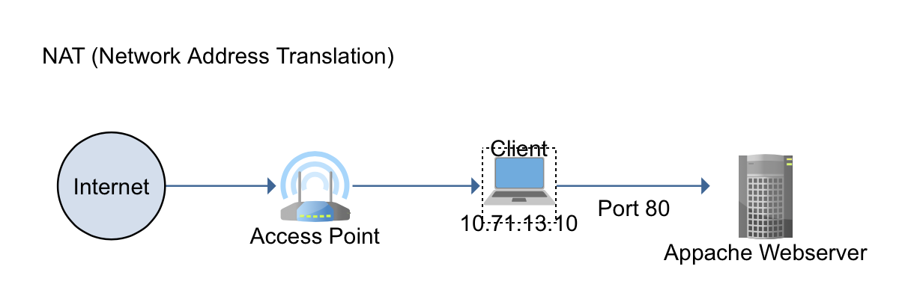
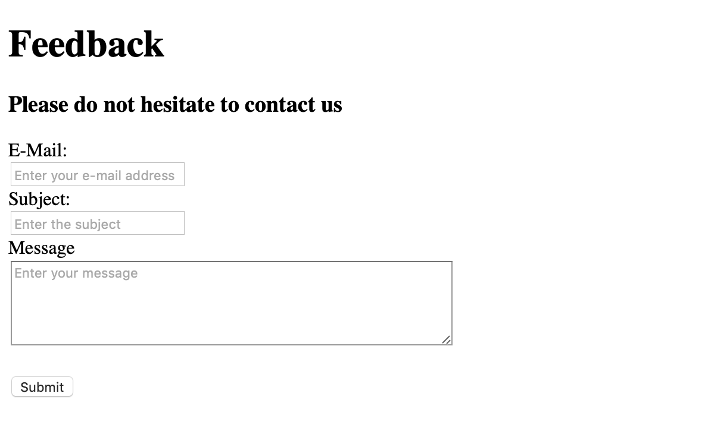
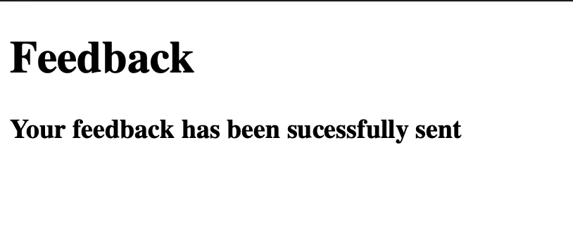
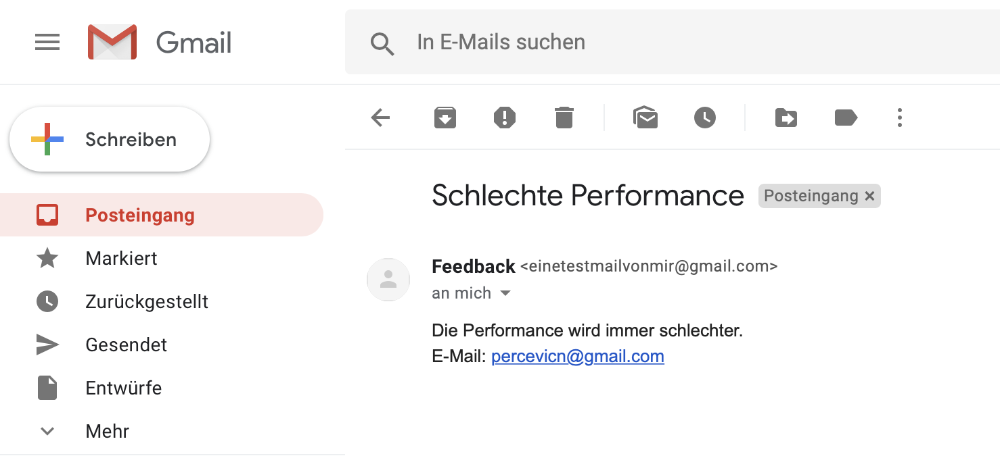

<h1>Modul 300 Dokumentation</h1>

<h2>Nemanja Percevic</h2>

## Inhaltsverzeichnis
* [Einleitung](#Einleitung) 
* [Vergleich Vorwissen mit Wissenszuwachs & aktueller Wissenstand](#Vergleich-Vorwissen-mit-Wissenszuwachs-&-aktueller-Wissenstand) 
* [Sicherheitsmassnahmen](#Sicherheitsmassnahmen) 
* [Testfälle](#Testfälle) 
* [Reflexion](#Reflexion-) 
* [Resultat](#Resultat) 

**<h2>Einleitung</h2>**
Ich hatte die Idee, einen Webserver zu installieren, über welchen ich eine Mail verschicken kann. Danach entwickelte sich diese Idee zu einem Mail-Feedback-Formular, welches man ausfüllen kann und dann wird eine Mail verschickt. Das ganze wurde mit Hilfe von Appache2 und PhpMailer aufgesetzt.

**index.php** 
Index.php file wird benötigt um die HTML-Seite nach meinem Bedürfnis zu erstellen. In diesem file habe ich das Formular erstellt, welches auf der Webseite angezeigt wird.

**dir.conf** 
Dieses File wird benötigt, um das index.php file vor dem index.html file zu laden. Das File index.php beinhaltet den Inhalt unserer Webseite.

**sendmail.php** 
Im sendmail.php befindet sich der Code, welcher benötigt wird, um das E-Mail schlussendlich richtig abzuschicken.

**<h2>Vergleich Vorwissen mit Wissenszuwachs & aktueller Wissenstand</h2>**
Am Anfang vom Modul wusste ich nichts über Git, Vagrant, MarkDown. Den Anfang fand ich sehr mühsam. Ich habe lange gebraucht, um mich einzuarbeiten, zu verstehen, wie Vagrant wirklich funktioniert, usw. Die automatisierte VM-Installation fand ich sehr spannend, vorallem wenn ich mir überlege, wo man das überall anwenden kann und wie viel Zeit man durch das sparen kann.

Ich hatte am Anfang Schwierigkeiten mit vm.synced_folders, um die Files in der VM zu überschreiben. Zum Beispiel das index.php file, welches für die Webseite gebraucht wird, wurde immer als Text in den vorhandenen File kopiert, und nicht als Code auf die VM kopiert. Also musste ich eine neue Lösung suchen. Ich kam dann auf "config.vm.provision :file, source: "sendmail.php", destination: "/tmp/sendmail.php"" und konnte somit eine grosse Herausforderung von mir durchstreichen.

**Linux/Ubuntu**

Ubuntu ist ein Open-Source-Software-Betriebssystem. Ubuntu ist eine Linux-Distribution, die auf Debian basiert. Ich habe für die LB1 Ubuntu Xenial 64 verwendet.

**VirtualBox**
VirtualBox ist ein kostenloser und Open-Source Hypervisor. Es unterstützt die Erstellung und Verwaltung von virtuellen Gastmaschinen. Unsere Ubuntu Xenial 64 Virtuelle Maschine kann über VirtualBox gestartet und genutzt werden.

**Virtualisierung**

Virtualisierung bezieht sich auf due Erstellung einer virtuellen Version von etwas, einschliesslich virtueller Computerhardwareplattformen, Speichervorrichtungen und Computernetzwerk-Ressourcen.

**Vagrant**

Vagrant ist ein Tool zum automatischen Erstellen und Verwalten von Virtuellen Maschinen. Dies kann sehr von Vorteil sein, da man die VM ein einziges Mal installieren und konfigurieren muss, und sie dann auch verschiedene Systeme ausbreiten kann und sie dort mit Hilfe vom Vagrantfile automatisch erstellen.

**Git**

Git ist ein spezifisches Open-Source-Versionskontrollsystem. Git ist ein verteiltes Versionskontrollsystem, was bedeutet, dass die gesamte Codebasis und Historie auf jedem Entwicklercomputer verfügbar ist. 

**Mark Down**

Markdown ist eine Markup-Sprache mit einfacher Textformatierungssyntax. Es ist sehr einfach zu gebrauchen und es macht auch Spass. Als Mark-Down Editor habe ich Visual Studio Code gebraucht.

**Netzwerkplan**

**<h2>Sicherheitsmassnahmen</h2>**
**TLS**
Das E-Mail wird verschlüsselt mit dem Übertragungsprotokolls TLS verschickt. Das ist sehr wichtig, damit das E-Mail während der Sendung nicht zu einer dritte Person landet. Im sendmail.php file steht **"$mail->SMTPSecure = 'tls';"**. Mit dieser Zeile wird sichergestellt, dass die E-Mails mit TLS verschlüsselt werden.

**Benutzer mit Administratorrechten**
Ebenfalls habe ich einen Benutzer "Einbenutzer" erstellt, den ich auch entsprechend in die Sudo Gruppe eingefügt habe, um die volle Sudo-Rechte zu haben. 
  *useradd EinBenutzer* 
  *echo "EinBenutzer:password" | chpasswd* 
  *sudo usermod -G sudo EinBenutzer* 

**Firewall**
Ich habe auch die Firewall eingeschaltet und die Ports 22 (SSH) und 80(Webserver) auf Allow gesetzt und defaults auf Deny. 
  *sudo ufw --force enable* 
  *sudo ufw default deny incoming* 
  *sudo ufw allow 22/tcp* 
  *sudo ufw allow 80/tcp* 

**<h2>Testfälle</h2>**

| Testfall | Tester | Datum | Resultat |
| :--:|:--:| :--:|:--:|
| Beim Klicken auf der Button soll eine neue Webseite erscheinen | Nemanja Percevic | 21.03.2019 | Neue Webseite wurde erfolgreich geladen |
 Das Feedback-Mail soll beim Klicken auf den Button gesendet werden | Nemanja Percevic | 21.03.2019 | Das Feedback-Mail wurde erfolgreich gesendet |
  Das Mail sollte nicht gesendet werden, sofern keine E-Mail Adresse eingetragen wurde | Nemanja Percevic | 21.03.2019 | Es wird nach der E-Mail Adresse gefragt |

**<h2>Reflexion</h2>**
Durch die LB1 konnte ich viele neue Sachen lernen, doch ich musste ebenfalls sehr viel Zeit investieren, da bei der LB1 fast alles neu war. Wie immer konnte ich mit Amauri Valdez sehr gut zusammenarbeiten, da wir bei solchen Aufträgen meistens zusammenarbeiten und uns gut verstehen können. Meiner Meinung nach konnten wir beide sehr viel lernen und uns gegenseitig sehr viel helfen.

**<h2>Resultat</h2>**

**Die Webseite:**

**Die zweite Webseite:**

**E-Mail:**

